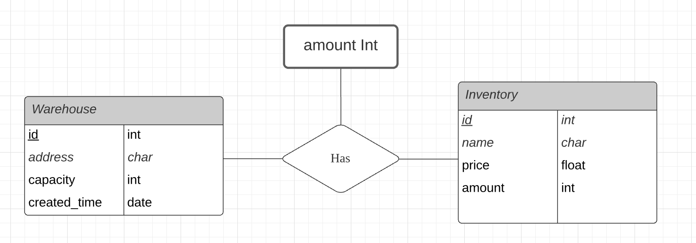

# Shopify Backend Project

This project implements a inventory tracking application for a logistic company.

### Additional Implemented feature

- Ability to create warehouses/locations and assign inventory to specific locations

### Database Schema


### Tech Stack

- Flask: Backend web server / RESTful API 
- PostgreSQL: Relational Database
- Flask-sqlalchemy: Object Relational Mapping (ORM) for secure communication between server and Database
- Docker: Containerize web server and database by docker-compose, fast deployment (You literally need only one command to start the project =)


## Best Practices Highlight:

- Factory design pattern: The entry point wsgi.py would call init_app to gererate the flask web server. It's the place where APIs, bluesprints, and database configuration are registered on the app. The loose-coupling nature of this design make it very flexible and scalable.
- MVC Architechture: Model(M) for database schema, View(V) for frontend user interface, Controller(C) for RESTful APIs

- RESTful API: The CRUD functionality is implemented using Flask-Restful, and follows the best practices to build those API.


## Installation

If you do not have Docker installed, please go to 

```bash
https://docs.docker.com/get-docker/
```

and download Docker based on your operating system.

Once you have Docker installed, clone this repository:

```bash
git clone https://github.com/YowKuan/Shopify-Backend-Project.git
cd Shopify-Backend-Project 
```

Run Docker Compose
```bash
docker-compose up
```
This command will execute the docker-compose.yaml file in the folder, and create two services: api, db for the application.

Once everything is done, go to the home page. 
```bash
http://localhost:8000
```


## Features

- CRUD on Inventories
- CRUD on Warehouses
- Basic error handling (ex. When editing the storage amount of inventories, you cannot change the value below the amount you have allocated to the warehouses.)
